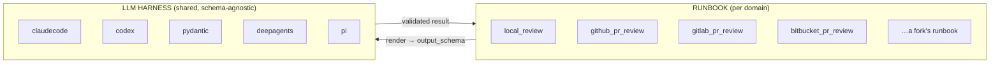
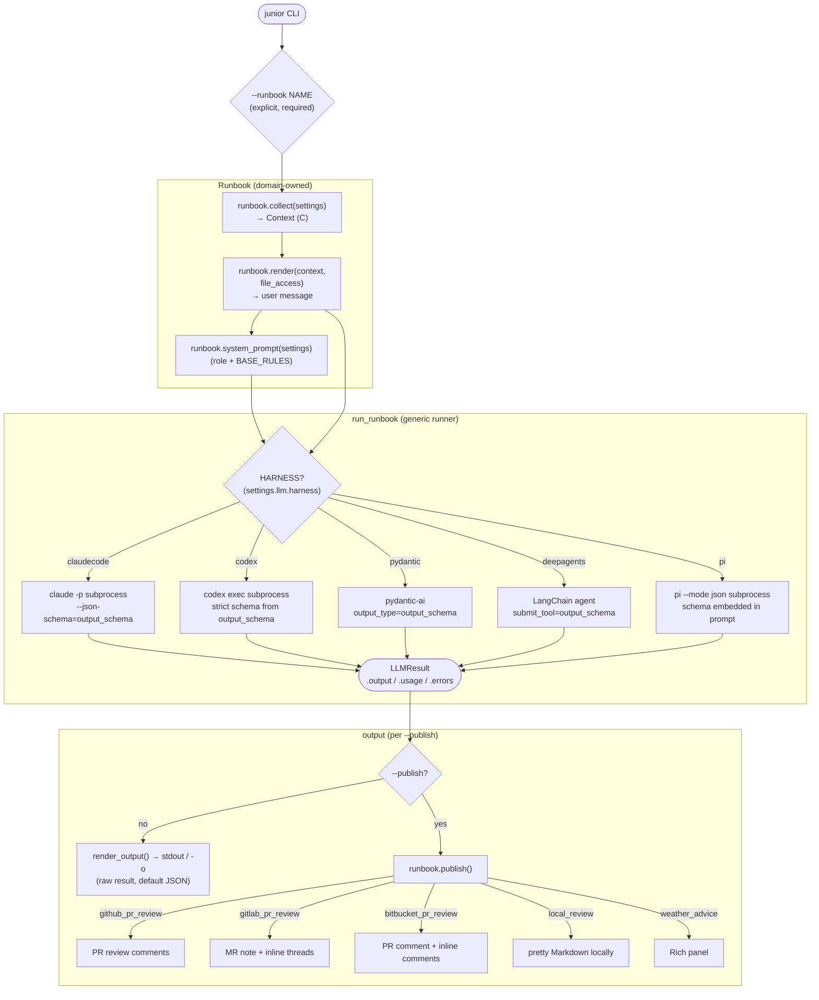

# Junior — Architecture

## Overview

Junior is a **runbook executor**. You hand it a *runbook* — a deterministic recipe of **collect → one schema-validated LLM call → publish** — and it runs it, in **CI pipelines** (GitLab CI, GitHub Actions) or **locally as a CLI tool**. The framework itself knows nothing about any particular task: **code review of MRs/PRs is the built-in flagship runbook, not the boundary.**

The division of labour is deliberate (it's the whole point — see [Philosophy](philosophy.md)): *you*, the senior, spell the runbook out in detail — what to collect, the exact output schema, how to publish — and the LLM fills in only the single non-deterministic step in the middle. The more of the work you pin down deterministically, the more reliable the run; a **runbook** collects context deterministically, hands it to a schema-agnostic **LLM harness**, and publishes the validated result.

## Runbook × Harness

Junior has exactly **two** independent extension points — Runbook and Harness. There is no separate "platform" selector — platform (local / GitHub / GitLab) is an internal detail of a runbook's own collect/publish, not a globally selectable knob.



- A **`Runbook`** (`src/junior/runbook/base.py`, generic over Context `C` and Result `R`) owns one domain. It brings its own `context_model` / `result_model` schemas and the domain logic: `collect → render → system_prompt → publish`. The platform variants live *inside* the runbook family.
- A **`Harness`** (same file) is shared across all runbooks. It knows nothing about diffs, MRs, or Jira: `complete()` takes a system prompt, a user message, and an **`output_schema` parameter**, calls the model, and returns an `LLMResult` whose `.output` is a validated instance of that schema. One set of harnesses serves every runbook.

The key move: **the output schema is a parameter of the harness, not a hard-coded type.** That is what lets five harnesses serve every runbook. The code-review runbooks ask for `ReviewOutput`; a fork's Jira runbook would ask the same harnesses for its own `TicketAssessment`.

## Review Flow



> [!NOTE]
> `run_runbook` (`src/junior/runbook/runner.py`) is given an **already-collected** context — collection is the caller's concern, so `junior run --from-file ctx.json` bypasses `collect()` entirely. The runner only does `harness.complete(...) → runbook.publish(...)`.

### `--publish-file FILE` shortcut

`junior run --publish-file out.md` skips collect and the LLM entirely. Junior reads the `.md`, wraps it in a `ReviewResult(pre_formatted=...)`, and calls the runbook's `publish_prepared` to post it to the platform. Requires a publishing runbook (`github_pr_review` / `gitlab_pr_review` / `bitbucket_pr_review`) plus the platform token and CI variables — see [CI Setup](ci.md).

## The contracts

### LLM harness

Every harness module exposes a module-level `HARNESS` instance implementing `Harness`:

```python
class Harness(ABC):
    name: ClassVar[str]              # matches the HarnessKind member, e.g. "codex"
    file_access: ClassVar[bool]      # True if the harness reads repo files itself

    @abstractmethod
    def complete(
        self, *,
        system_prompt: str,
        user_message: str,
        output_schema: type[BaseModel],   # ← the runbook's result_model
        settings: Settings,
    ) -> LLMResult: ...
```

`LLMResult` is an envelope: `.output` (validated `output_schema` instance), `.usage` (`Usage` token counts), `.errors` (partial-failure notes, e.g. one sub-agent died). The only schema plumbing differs per harness — claudecode passes the schema via `--json-schema`, codex builds a strict JSON schema with openai's `to_strict_json_schema`, pydantic-ai uses `output_type=`, deepagents builds a submit tool from it, pi embeds the schema in the system prompt and validates the reply.

`file_access` lets a runbook avoid inlining a full diff for harnesses that read files themselves (`claudecode`, `codex`, `pi` → `True`; `pydantic`, `deepagents` get the diff inline → `False`).

### Runbook

```python
class Runbook(ABC, Generic[C, R]):
    name: ClassVar[str]
    context_model: ClassVar[type[BaseModel]]   # C — for JSON round-trip (--from-file)
    result_model: ClassVar[type[BaseModel]]    # R — the schema handed to the harness
    needs_git: ClassVar[bool] = False          # preflight requires a .git repo?

    @abstractmethod
    def collect(self, settings) -> C: ...                         # may dispatch gitlab/github/local
    @abstractmethod
    def render(self, context, settings, *, file_access) -> str: ...
    def system_prompt(self, settings) -> str: ...                 # SYSTEM_PROMPT role + --prompts
    @abstractmethod
    def publish(self, settings, result, usage, *, errors) -> None: ...    # only with --publish
    def render_output(self, result) -> str: ...                   # no --publish output (default JSON)
    def validate(self, settings, *, publish_enabled) -> list[str]: ...   # runbook-specific checks
    def is_blocking(self, result) -> bool: ...                    # exit-code policy (default False)
    def is_empty(self, context) -> bool: ...                      # skip the LLM (default False)
    def summary(self, result) -> dict: ...                        # final "done" log line
```

ABCs are used deliberately: this is a **forkable framework**, and a forgotten method should fail loudly at instantiation (`TypeError: Can't instantiate abstract class …`) rather than surface as an obscure `AttributeError` later.

### Harness dispatch

```python
# config.py — enum value = harness module path
class HarnessKind(_ModulePathEnum):
    PYDANTIC   = "junior.harnesses.pydantic"
    CODEX      = "junior.harnesses.codex"
    CLAUDECODE = "junior.harnesses.claudecode"
    DEEPAGENTS = "junior.harnesses.deepagents"
    PI = "junior.harnesses.pi"

# registry.py — import the module, read its HARNESS instance
def get_harness(kind: HarnessKind) -> Harness:
    module = importlib.import_module(kind.value)
    return module.HARNESS
```

Short names work via `_missing_`: `HarnessKind("codex")` → `HarnessKind.CODEX`. New harness = one file exposing `HARNESS` + one enum member.

## Runbook selection & registry

Runbook selection is **explicit** — there is no token auto-detection. Choose it with `--runbook NAME`, config `runbook:`, or env `RUNBOOK`; with none set, the run exits 2 — there is no implicit default.

The registry (`src/junior/runbook/registry.py`) merges runbooks from four sources:

1. **Built-in** — every subpackage of `junior.runbooks` is auto-discovered via a `pkgutil` scan (no hardcoded list); importing it runs its registration.
2. **External plugin** — a pip-installed package declaring a `junior.runbooks` entry point (`name = "pkg.module:ClassName"`).
3. **Direct path** — `--runbook "pkg.module:ClassName"` loads a `Runbook` subclass directly.
4. **Repo-local** — with `local_runbooks: true` (opt-in; executes repo code), `registry.load_local_runbooks()` loads `<project>/.junior/runbooks/*.py` (`@register_runbook` classes) and YAML manifests (driving a `ScriptRunbook`).

See [Adding a runbook](adding_runbooks.md) or [a harness](adding_harnesses.md) and the [runbook framework deep-dive](architecture/runbooks.md).

## The code-review runbook family

The built-in code-review runbooks all review a git diff with the same `ReviewContext` in and `ReviewOutput` out. They share a base class `CodeReviewRunbook` (`src/junior/runbooks/code_review/base.py`) holding render, `system_prompt`, `result_model`, `is_blocking`, `summary`, and a **template-method `publish`** that delegates to `_post_to_platform` (run only with `--publish`). The variants differ only in `collect()` and `_post_to_platform()`. Without `--publish`, all of them emit the raw `ReviewOutput` as JSON to stdout/`-o`:

| Runbook | collect | `--publish` does |
|----------|---------|------------------|
| `local_review` | local git diff | renders pretty Markdown locally |
| `github_pr_review` | GitHub PR via API | posts PR review comments |
| `gitlab_pr_review` | GitLab MR via API | posts MR note + inline threads |
| `bitbucket_pr_review` | Bitbucket DC PR via API | posts PR comment + inline comments |

The collector/publisher implementations live in `src/junior/collect/{local,gitlab,github,bitbucket}.py` (`collect(settings) -> ReviewContext`) and `src/junior/publish/{local,gitlab,github,bitbucket}.py` (`post_review(settings, result)`). Each runbook variant imports the one it needs directly — there is no central `resolved_collector`/`resolved_publisher` dispatch.

## Settings groups

Settings split into three frozen groups plus two top-level scalars:

| Group | Holds |
|-------|-------|
| `settings.context` (`ContextSettings`) | source/diff inputs, project dir, `context.prompts` (the user's `--prompt`s) |
| `settings.llm` (`LLMSettings`) | `harness` (the LLM driver), `model`, API keys, limits |
| `settings.output` (`OutputSettings`) | output file, platform tokens/IDs, `publish` flag |
| `settings.runbook` | which runbook to run (registry name or `module:ClassName`) |
| `settings.log_level` | logging verbosity |

> [!NOTE]
> `settings.llm` was previously `settings.review` (`ReviewSettings`). The system prompt is the runbook's own — its `SYSTEM_PROMPT` role merged with the user's `context.prompts` (`--prompt` / `--prompt-file`).

Validation is split: **generic** checks (context files, LLM API key) live in `Settings.preflight`; **runbook-specific** checks (e.g. a publishing runbook needs `GITHUB_TOKEN`) live in `Runbook.validate`.

## Project Layout

```
src/junior/
  cli/                  ← Typer CLI surface (split by concern)
    app.py              ← @app.callback + subcommands (run, dry-run, list, init, config)
    options.py          ← reusable Annotated option types + panel constants
    settings_builder.py ← Settings construction from config + CLI flags
    observability.py    ← structlog setup + startup logging
    config_show.py      ← `config show` (effective config + status) + `config env`
    listing.py          ← `junior list` / `config list`: runbooks + harnesses (+ readiness)
    console.py          ← shared Rich consoles: stdout (content) + stderr (status/errors)
    actions.py          ← orchestration: collect, run, emit raw output / publish
    runs.py             ← `junior runs`: browse run records under .junior/output/
  interactive/          ← wizard for `init` + `run -i`
  config.py             ← Settings groups (Context / LLM / Output) + runbook + log_level + local_runbooks
  init_config.py        ← `junior config init` saves to ~/.config/junior/settings.yaml
  models.py             ← deprecated shim → runbooks/code_review/models.py
  run_record.py         ← write_run_record(): secret-free .junior/output/{ts}.json
  prompt_loader.py      ← inline text + file:// URIs → Prompt objects

  runbook/             ← the framework (domain-agnostic core)
    base.py             ← Runbook + Harness ABCs, LLMResult, Usage
    runner.py           ← run_runbook(): complete → publish only when --publish
    registry.py         ← get_runbook (built-in + entry-point + path + repo-local), get_harness

  harnesses/            ← shared LLM drivers (each exposes HARNESS)
    claudecode.py       ← claude -p subprocess, --json-schema
    codex.py            ← codex exec subprocess, strict JSON schema
    pydantic.py         ← pydantic-ai, single structured call (output_type)
    deepagents.py       ← LangChain agent, submit_tool from output_schema
    pi.py               ← pi --mode json subprocess, schema embedded in prompt

  runbooks/            ← built-in runbooks (auto-discovered)
    code_review/
      base.py           ← CodeReviewRunbook (shared render/prompt/publish)
      models.py         ← domain models: ReviewContext, ReviewOutput, ReviewResult, … (frozen)
      local.py  github.py  gitlab.py  bitbucket.py   ← per-platform collect + _post_to_platform
      render.py         ← build_user_message()
      instructions.py   ← build_review_prompt() + BASE_RULES
    weather/            ← example non-code-review runbook (live weather → what to wear)
    script/             ← ScriptRunbook: manifest-driven (prompt + optional schema/collect/publish)

  collect/              ← deterministic context collection (imported by runbooks)
    local.py  gitlab.py  github.py  bitbucket.py
    core/               ← collect_base, diff parsing, base-SHA resolve
  publish/              ← result posting (imported by runbooks)
    local.py  gitlab.py  github.py  bitbucket.py
    core/               ← markdown formatter, format_inline_comment
```

The harnesses are schema-agnostic and never import a runbook; the runbooks own all prompt/context/platform logic and import the collect/publish helpers they need. The runner ties runbook and harness together generically.
