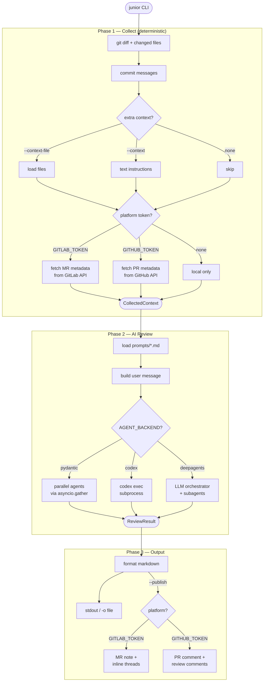

# Junior — Architecture

## Overview

Junior is an AI code review agent that runs in **CI pipelines** (GitLab CI, GitHub Actions) or **locally as CLI tool**. It collects MR/PR context deterministically, delegates analysis to AI agents, and publishes structured review comments.

## Design Principles

1. **Deterministic first** — diff collection runs before any LLM call
2. **Pluggable prompts** — .md files with frontmatter, selectable at runtime
3. **Graceful degradation** — each phase catches errors independently
4. **Extensible context** — `--context` and `--context-file` for arbitrary data

## Review Flow



## Pipeline (text)

```
junior --prompts common
│
├─ Phase 1: COLLECT (deterministic, no AI)
│   ├─ git diff → changed files → commit messages
│   ├─ extra context: --context (text) / --context-file (files)
│   └─ platform enrichment: GitLab/GitHub API → MR/PR metadata (if token set)
│
├─ Phase 2: REVIEW (AI)
│   ├─ load prompts from prompts/*.md
│   ├─ build user message (context_builder.py)
│   └─ dispatch to agent backend:
│       ├─ pydantic   → parallel agents via asyncio.gather
│       ├─ codex      → single codex exec subprocess
│       └─ deepagents → LLM orchestrator + subagents
│
└─ Phase 3: OUTPUT
    ├─ always: stdout or -o file
    └─ with --publish: GitLab MR notes / GitHub PR comments
```

## Backend Dispatch Pattern

All three components use the same pattern: enum value = module path.

```python
# config.py
class CollectorBackend(str, Enum):
    GITHUB = "junior.collect.github"
    GITLAB = "junior.collect.gitlab"
    LOCAL  = "junior.collect.local"

class AgentBackend(str, Enum):
    PYDANTIC   = "junior.agent.pydantic"
    CODEX      = "junior.agent.codex"
    DEEPAGENTS = "junior.agent.deepagents"

class PublishBackend(str, Enum):
    GITHUB = "junior.publish.github"
    GITLAB = "junior.publish.gitlab"
    LOCAL  = "junior.publish.local"

# dispatch (same pattern in all __init__.py):
module = importlib.import_module(backend.value)
```

New backend = one file + one enum member. See [adding_backends.md](adding_backends.md).

Short names work via `_missing_`: `AgentBackend("pydantic")` → `AgentBackend.PYDANTIC`.

## Platform Auto-Detection

Collector and publisher are auto-detected from token presence:

```
GITLAB_TOKEN set  → gitlab collector + gitlab publisher
GITHUB_TOKEN set  → github collector + github publisher
no token          → local collector  + local publisher
both tokens       → error: remove one
```

## Project Structure

```
src/junior/
  cli.py                 ← entry point: collect → review → publish
  config.py              ← Settings (frozen), backend enums, auto-detection
  models.py              ← Pydantic data models (frozen)
  prompt_loader.py       ← load prompts/*.md with frontmatter

  collect/               ← Phase 1: deterministic collection
    __init__.py          ← dispatch + DEBUG JSON log
    local.py             ← no API enrichment
    gitlab.py            ← + GitLab MR metadata
    github.py            ← + GitHub PR metadata
    core/
      collect.py         ← collect_base(), enrich_with_metadata()
      diff.py            ← git diff, parse, commit messages

  agent/                 ← Phase 2: AI review
    __init__.py          ← dispatch + DEBUG JSON log
    pydantic.py          ← parallel agents via pydantic-ai
    codex.py             ← codex exec subprocess
    deepagents.py        ← LLM orchestrator + subagents
    core/
      context_builder.py ← build user message for AI
      instructions.py    ← read AGENT.md / CLAUDE.md

  publish/               ← Phase 3: post results
    __init__.py          ← dispatch by PublishBackend
    local.py             ← stdout or file output
    gitlab.py            ← GitLab MR notes
    github.py            ← GitHub PR comments
    core/
      formatter.py       ← markdown formatting

  prompts/               ← review prompt files
    security.md
    logic.md
    design.md
    docs.md
    common.md
```

## Exit Codes

| Code | Meaning |
|------|---------|
| 0 | Review completed |
| 1 | Blocking issues found (only with `FAIL_ON_CRITICAL=true`) |
| 2 | Configuration error |
| 3 | Runtime error |
