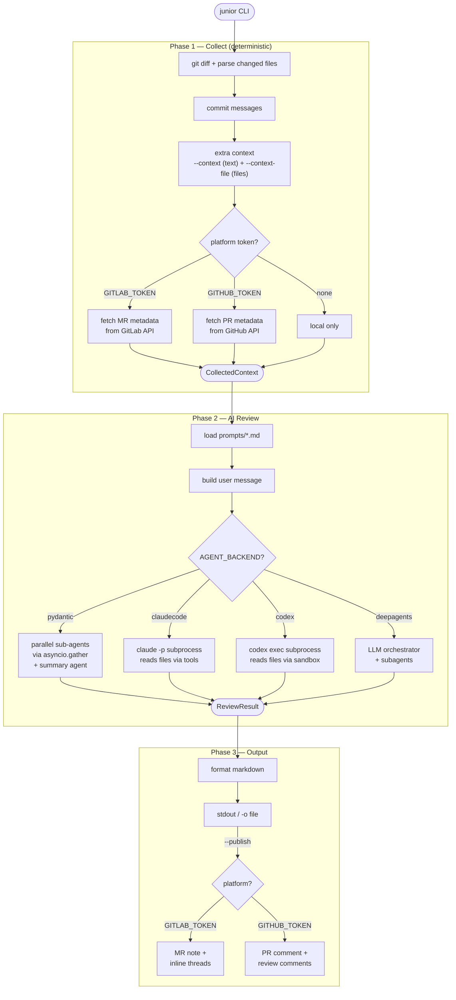

# Junior — Architecture

## Overview

Junior is an AI code review agent that runs in **CI pipelines** (GitLab CI, GitHub Actions) or **locally as CLI tool**. It collects MR/PR context deterministically, delegates analysis to AI agents, and publishes structured review comments.

## Review Flow



### `--publish FILE` shortcut

When `--publish` receives a file path, the entire pipeline is skipped. Junior reads the .md file, wraps it in a `ReviewResult(pre_formatted=...)`, and publishes directly to the platform. Requires a platform token and CI variables — see [CI Setup](ci.md).

## Pipeline (text)

```
junior --prompts common
│
├─ Phase 1: COLLECT (deterministic, no AI)
│   ├─ git diff → parse changed files → commit messages
│   ├─ extra context: --context (text) AND --context-file (files)
│   └─ platform enrichment: GitLab/GitHub API → MR/PR metadata (if token set)
│
├─ Phase 2: REVIEW (AI)
│   ├─ load prompts from prompts/*.md
│   ├─ build user message (context_builder.py)
│   └─ dispatch to agent backend:
│       ├─ pydantic   → parallel sub-agents + summary agent
│       ├─ claudecode → claude -p subprocess (reads files via tools)
│       ├─ codex      → codex exec subprocess (reads files via sandbox)
│       └─ deepagents → LLM orchestrator + subagents
│
└─ Phase 3: OUTPUT
    ├─ always: format markdown → stdout or -o file
    └─ if --publish: also post to GitLab MR notes / GitHub PR comments
```

## Backend Dispatch Pattern

All three components (collect, agent, publish) are **interfaces** — each has multiple implementations that are interchangeable at runtime. The implementation is selected by enum value, which is a Python module path.

### Contracts

Each backend module must export one function with a fixed signature:

| Component | Function | Signature |
|-----------|----------|-----------|
| Collector | `collect()` | `(settings: Settings) -> CollectedContext` |
| Agent | `review()` | `(context: CollectedContext, settings: Settings, prompts: list[Prompt]) -> ReviewResult` |
| Publisher | `post_review()` | `(settings: Settings, result: ReviewResult) -> None` |

Implementations vary widely — subprocess calls (`claudecode`, `codex`), async SDK (`pydantic`), LLM orchestrator (`deepagents`) — but all conform to the same interface.

### Dispatch

```python
# config.py — enum value = module path
class AgentBackend(str, Enum):
    PYDANTIC = "junior.agent.pydantic"
    CLAUDECODE = "junior.agent.claudecode"
    CODEX = "junior.agent.codex"
    DEEPAGENTS = "junior.agent.deepagents"

# agent/__init__.py — dispatch
module = importlib.import_module(backend.value)
return module.review(context, settings, prompts)
```

New backend = one file + one enum member. See [Adding backends](adding_backends.md).

Short names work via `_missing_`: `AgentBackend("pydantic")` → `AgentBackend.PYDANTIC`.

## Platform Auto-Detection

Collector and publisher are auto-detected from token presence:

```
GITLAB_TOKEN set  → gitlab collector + gitlab publisher
GITHUB_TOKEN set  → github collector + github publisher
no token          → local collector  + local publisher
both tokens       → error (validation rejects at startup)
```

